# Introduction

Here, an app will interact with tables with an MsSql database, and query it to show a web page with the table.

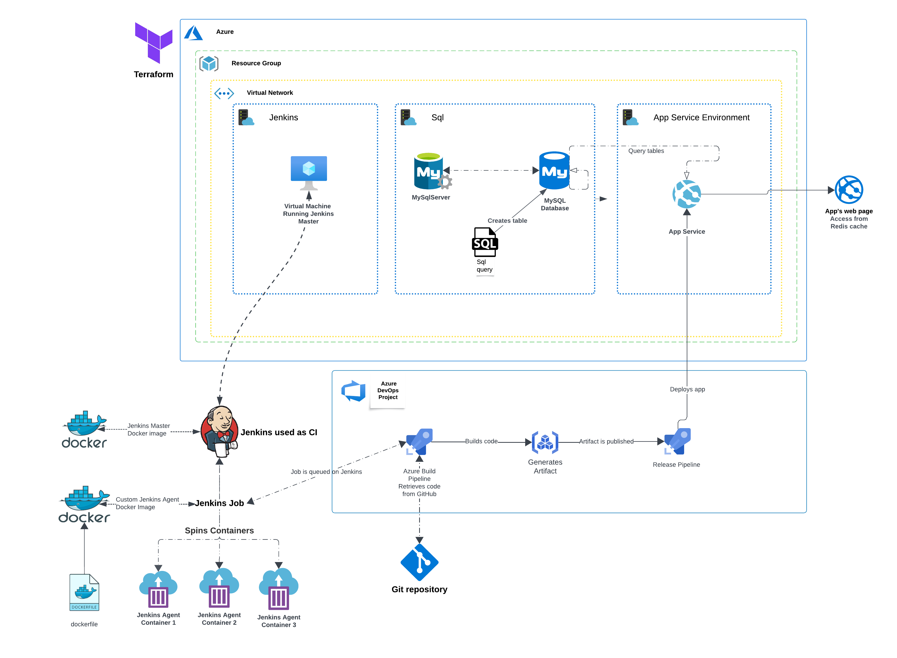

>`Architecture`

The app is an ASP.Net running in C#

All the resources will be deployed with Terraform.

The app will be built with Jenkins, which will be used as CI for an Azure DevOps environment.

## Notes:

- Don't forget to change `terraform.tfvars` to set vm admin username, storage account key etc.;ｚ

- The Virtual machines password will NOT be on the output, instead they can be securely found in the `terraform.tfstate` file; the sql server password will also be there.

- The vm's will have a script extension to install docker and to configure the Jenkins agent.

- These scripts will be on the `vmscriptextension` folder, the `script.sh` is for the master vm containing Jenkins, and the `script2.sh` is for the agent vm.

- The Jenkins agent will be configured to run docker containers as agents.

- The Jenkins job will be configured to build the app, and to deploy it into an Azure App Service.

- Be careful when setting the `Jenkins Job Name` on the Azure DevOps pipeline, it must be the exact name of the Jenkins job, also
- the paths in the jenkinsfile must be correctly set, or else the build will fail.

## Before we start

- To see how to integrate Jenkins and Azure for Continuous Integration, [click here](https://github.com/nokorinotsubasa/CI-jenkins-azure)

- To see how to use docker containers as Jenkins agents, [click here](https://github.com/nokorinotsubasa/jenkins-docker-agent)

- Remember to allow connections on the sql server Networking configuration, also, enable `Allow Azure services and resources to access this server`:

## Code configuration

- Change the `appsettings.json` file to set the connection string to the database;

## Jenkins Configuration

- First, let's run `terraform` to deploy all the resources we need; the Virtual machines will run script extensions upon creation, to speed up the process;

- The Jenkins agent Vm will `already be configured` to spin docker containers, thanks to the script extension implementation;

- Proceed with jenkins configuration, create an admin user, download `Docker`, `github` and `azure cli` plugins; Access
- it with the `Vm IP:8080` and unlock it with the initial password;
>`you will have to login into the vm to get the password, it will be on the logs of the jenkins container`

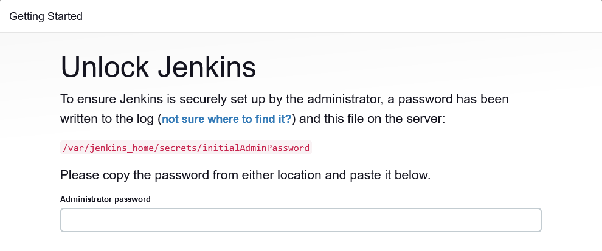

you can get the initial password with:

    sudo docker logs jenkins

- Set up `GitHub connection` on Jenkins for code checkout, to do this:

In the Vm, generate ssh keys:

    ssh-keygen -t rsa

>The `public` key goes into the `github settings`; the `private key` into the `jenkins credentials settings`;

you need to add it into the `known_hosts_file`, to do this:

    ssh-keyscan github.com >> ~/.ssh/known_hosts

Don't forget to start the ssh agent:

    eval ssh-agent

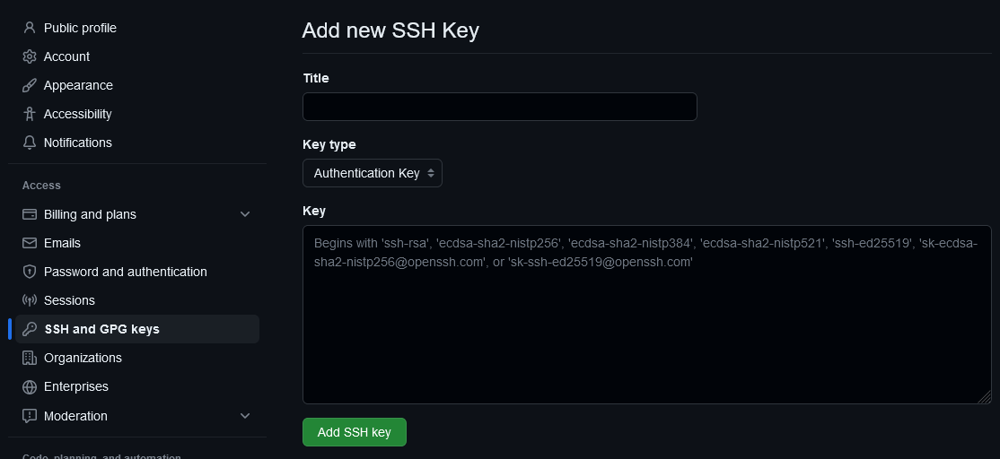

>`GitHub ssh key configuration`

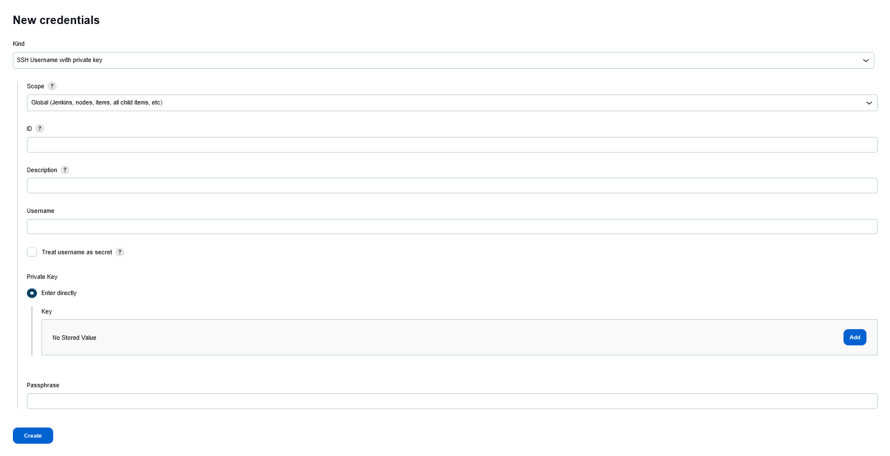

>`Jenkins GitHub credential configuration`

- Set up docker `cloud provider` on Jenkins, for the container agents. Remember to correctly set the agent Vm IP;

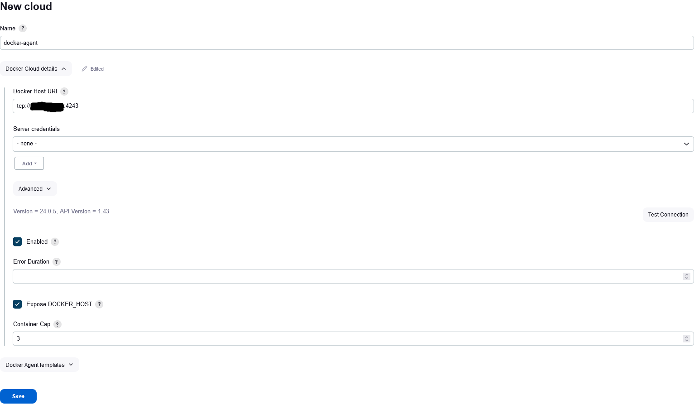

- Create a new Job on Jenkins of type pipeline, set the source code as: `Source code from scm` and set GitHub ssh credentials and connection.

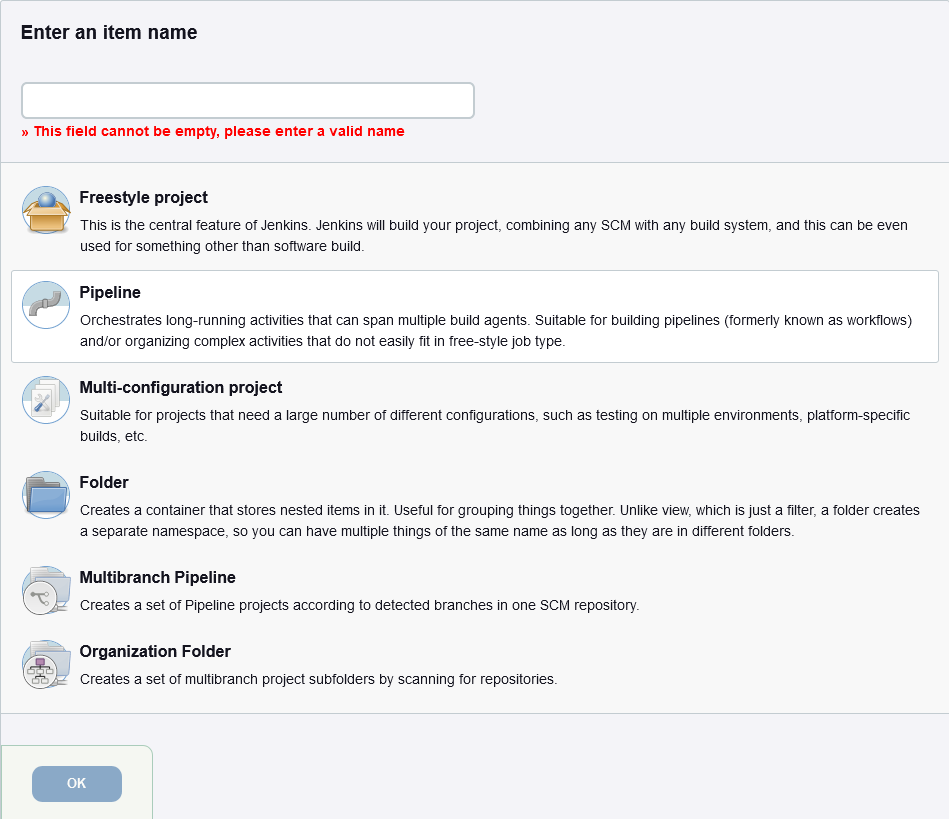

## Note:

- Strict checking will be disabled to facilitate the connection between the Jenkins and the GitHub repository, to do this:
Head into Jenkins Security settings, and disable `Host Key Verification Strategy`;

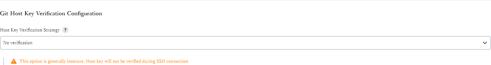

- Now, follow [this link](https://github.com/nokorinotsubasa/CI-jenkins-azure) to integrate Jenkins into Azure;

## Database configuration

- Access the database and run the `script.sql` (it can be found on this repository)

`You will need to add your client IP to the firewall rules to access the database`

- This script will create a table and insert some data into it;

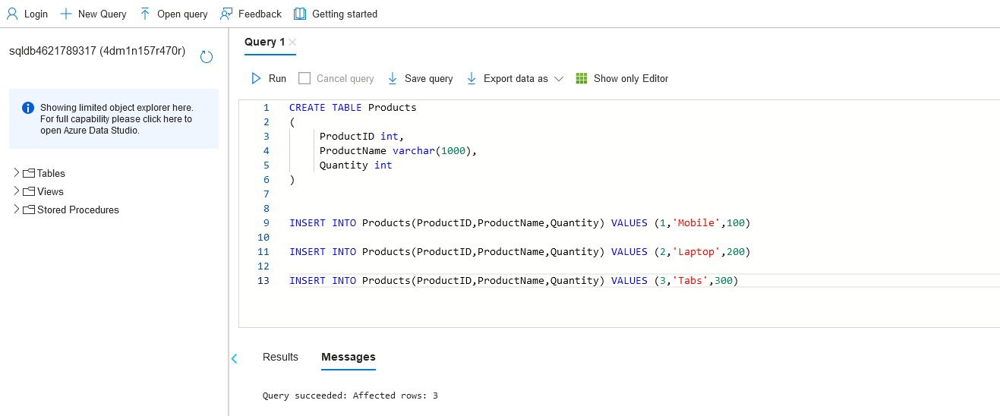

>`script.sql query`

## Docker-Agent configuration

- To see how to configure docker containers as Jenkins agents, [click here](https://github.com/alexsander-projects/jenkins-docker-agent)

## Azure DevOps configuration

- Now on Azure DevOps, with Jenkins and GitHub service connection, create a new Pipeline, select `Pipeline template`;

- Search and select `Jenkins`;

- Correctly set the required fields, `REMEMBER THAT THE JOB NAME IS THE EXACTLY JOB NAME OF THE JENKINS JOB`;

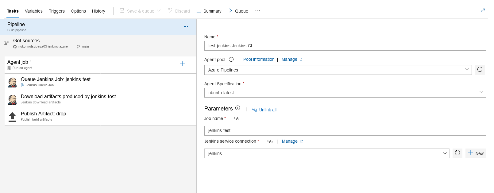

>`Pipeline configuration`

- Create a `Release Pipeline` on azure, and select the Azure web app job, insert the app service type, name and framework;

- Configure the artifact source, in our case: `build`;

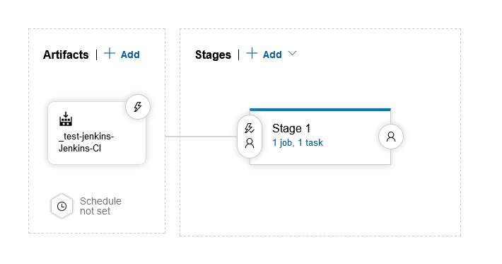

>`Release Pipeline Configuration`

- Activate the `Continuous Delivery` trigger;

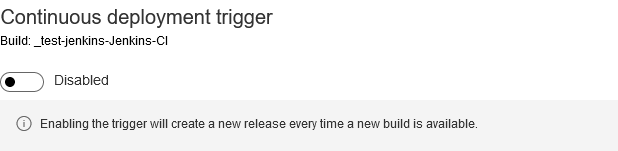

>`Release Pipeline trigger`

- Head back into `Pipelines` and set the `Continuous Integration` trigger (GitHub commit);

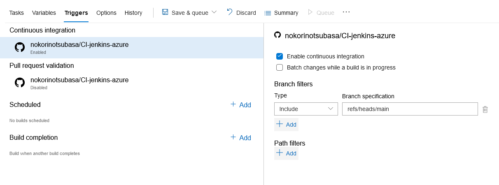

>`CI trigger`

- Now, upon running the Pipeline, it will queue the Jenkins job, building the app and generating the `artifact`, this will be downloaded into the build pipeline on Azure DevOps, to be later used;

>`Azure, Jenkins job logs`

- The Release Pipeline will start running, this will download the artifact from the build, and deploy the app into our `Azure App Service`.

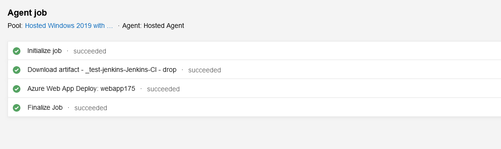

>`Release Pipeline logs`

## Final result

- Now, when accessing the web page, you will get a list of products; On every approved commit, a pipeline will run, building and deploying a new version of the app, thanks to CI/CD integration.

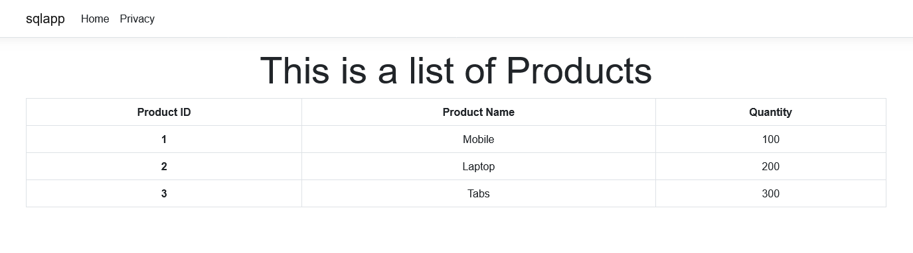
>`app's web page`

## How to Persist Jenkins data

- To know how to persist Jenkins data, [click here](https://github.com/nokorinotsubasa/tar-jenkins-docker)